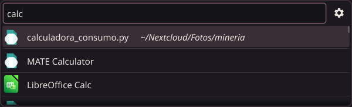
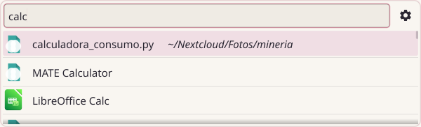
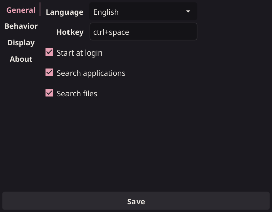

<p align="center">
  
</p>

<h1 align="center">laucha</h1>

<p align="center">
  A minimalist, keyboard-driven launcher for Linux.<br/>
  Fast, resident, skinnable and translatable — built with Go and <a href="https://fyne.io">Fyne</a>.
</p>

<p align="center">
  
  
  
</p>

<p align="center">
  
</p>

## Why laucha?

Every launcher kept forgetting where things are. laucha keeps a **persistent index that stays fresh in real time** — a file you downloaded two seconds ago is already searchable. And it learns: what you actually open rises to the top.

*"laucha"* is Rioplatense slang for a small mouse: tiny, quick, and it always knows where everything is.

## Features

- **App search** with real icons — fuzzy and case-insensitive: `spo` finds Spotify, `calc` finds the calculator
- **Live file index** — SQLite-backed, kept fresh by inotify watchers; new files are searchable instantly
- **Multi-term search across name and path**, in any order: `notas nextcloud` and `nextcloud notas` both narrow `notas.txt` down to the copy under `~/Nextcloud`
- **Frecency ranking** — equally good matches surface what you actually use first; ties prefer shallower paths
- **Recent files view** when the bar opens, newest first
- **Self-sizing bar** — with no results it collapses to just the input; it grows one row per result up to the configured maximum, then scrolls
- **Resident**: global hotkey (`ctrl+space`) toggles the bar instantly; system tray icon with dynamic menu; Esc, launching or losing focus just hide it
- **Single instance** — launching the binary again shows the running bar in ~25ms
- **Skinnable** — drop-in skin folders; two built-ins (`default-dark`, `default-light`); switching applies live
- **Settings window** with vertical tabs; every change saves and applies automatically — no Save button (only the language needs a restart)
- **Search filters UI** — default configuration that improves with every update, or full advanced control: indexed folders, exclude/include-only mode, extensions, names and regex patterns, with live reindexing
- **Hotkey capture** — click the field and press the combination; no typing
- **Translatable** — English and Spanish today; a new language is one JSON file
- Bundled file-type icons (pdf, spreadsheet, image, audio, video, code, …) consistent on every desktop theme
- Optional autostart at login

## Screenshots

| Default Light | Settings |
| --- | --- |
|  |  |

## Install

### Binary (recommended)

Download the latest binary from [Releases](https://github.com/lucas77x/laucha/releases) — it is self-contained, no dependencies needed:

```sh
chmod +x laucha
./laucha            # first run builds your file index
./laucha install    # add laucha to your applications menu
```

Remove the menu entry anytime with `./laucha uninstall`.

### Build from source

```sh
# Build dependencies (Debian/Ubuntu)
sudo apt install pkg-config libgl1-mesa-dev xorg-dev libxkbcommon-dev libwayland-dev wayland-protocols

git clone https://github.com/lucas77x/laucha
cd laucha
go build .
./laucha install
```

The first run walks your home directory to build the index; later runs search instantly on the stored index while a background walk reconciles it.

## Usage

| Key | Action |
| --- | --- |
| `ctrl+space` | Show / hide the bar (configurable) |
| Type | Search apps and files as you type |
| `↑` / `↓` | Move selection |
| `Enter` | Launch / open |
| `Esc` | Hide |

The gear button — or the tray menu — opens Settings.

## Configuration

`~/.config/laucha/config.toml`, created with defaults on first run:

```toml
language = "system" # or "en", "es"
hotkey = "ctrl+space"

[window]
width = 640
max_items = 4 # visible rows before scrolling (3-10)
skin = "default-dark" # or "default-light", or any drop-in skin

[behavior]
show_tray_icon = true
minimize_on_close = true
hide_on_focus_lost = true
show_recent_on_open = true
autostart = false
start_hidden = false # start resident without showing the bar

[search]
apps = true
files = true
advanced = false # false: laucha's built-in roots and filters apply
roots = ["~"]

[filter]
mode = "exclude" # exclude | include-only
extensions = []
names = ["node_modules", "__pycache__"]
patterns = ['(^|/)\.[^/]+'] # RE2 regex; default hides dotfiles
```

Search filtering has two modes, switchable from Settings → Search. **Default configuration** uses laucha's built-in roots and exclusions (package caches, hidden files) — and inherits improvements automatically on every update. **Advanced configuration** replaces the defaults entirely: pick the indexed folders, the filter mode (exclude listed / include only listed) and the three matchers (extensions, names, RE2 patterns). Saving reindexes in the background while search keeps working.

If some directories exceed the inotify watch limit, laucha logs it and search still works — raise `fs.inotify.max_user_watches` to watch everything.

## Skins

A skin is a folder dropped into `skins/<name>/` next to the binary, or into `~/.config/laucha/skins/`. Unset values fall back to the built-in defaults, so a three-line skin is valid. Switching skins applies live.

```toml
name = "My skin"
template = "classic"

[colors]
background = "#1B191F"       # bar and windows
foreground = "#E8E4DE"       # primary text
muted = "#8A879B"            # file paths, placeholders
accent = "#E8A0B4"           # focus, links, highlights
selection = "#3A2E36"        # selected row
input_background = "#141317" # search input
# on_accent = "#241F26"      # text over accent; auto-contrast when unset

[font]
size = 15

[rows]
height = 46
icon_size = 30

[border]
color = "#E8A0B455" # bar outline; supports #RRGGBBAA
width = 1
radius = 10

[images]
background = "background.png" # optional, stretched to the window
```

Elevation, separators, hover and button colors are derived from the declared palette automatically — skins name a world, laucha builds the layers.

## Translations

One JSON file per language in `internal/i18n/translations/`; keys are the English source strings. Adding a language is adding one file — contributions welcome.

## Project layout

```
main.go              composition root
internal/launcher    domain types (Entry)
internal/config      TOML settings, defaults, clamping
internal/search      ranking engine over pluggable providers
internal/index       live file index: SQLite + walker + fsnotify
internal/apps        .desktop discovery + icon resolution
internal/usage       open counts for frecency
internal/skin        drop-in skin loading
internal/instance    single-instance socket
internal/autostart   XDG autostart entry
internal/i18n        translation wrapper (Fyne lang)
internal/ui          bar, settings, tray, theming (Fyne)
third_party/systray  vendored fyne.io/systray with SNI patches
third_party/hotkey   vendored golang.design/x/hotkey with an event filter
```

`third_party/systray` is a vendored copy of [fyne.io/systray](https://github.com/fyne-io/systray) (Apache-2.0) with two added functions (`SetIconName`, `SetStatus`): ayatana-based tray hosts (MATE, XFCE) ignore `IconPixmap`, so laucha publishes its tray icon by file path — the same strategy Qt applications use.

`third_party/hotkey` is a vendored copy of [golang.design/x/hotkey](https://github.com/golang-design/hotkey) (MIT) whose X11 event loop only reports the registered combination. The upstream loop selects key events on the root window and then fires the callback for every one that arrives, so keys belonging to other applications — a desktop menu that grabs the Super key, a window manager shortcut — could open the launcher.

## Development

```sh
go test ./internal/...   # unit tests
go vet ./internal/...
gofmt -l .
```

The About screen (tray → About, or Settings → About) checks GitHub Releases for new versions.

## Roadmap

- Visual skin creator/editor
- Verified self-updating binary (checksummed release assets)
- Windows and macOS support
- More layout templates for skins

## License

[MIT](LICENSE)
